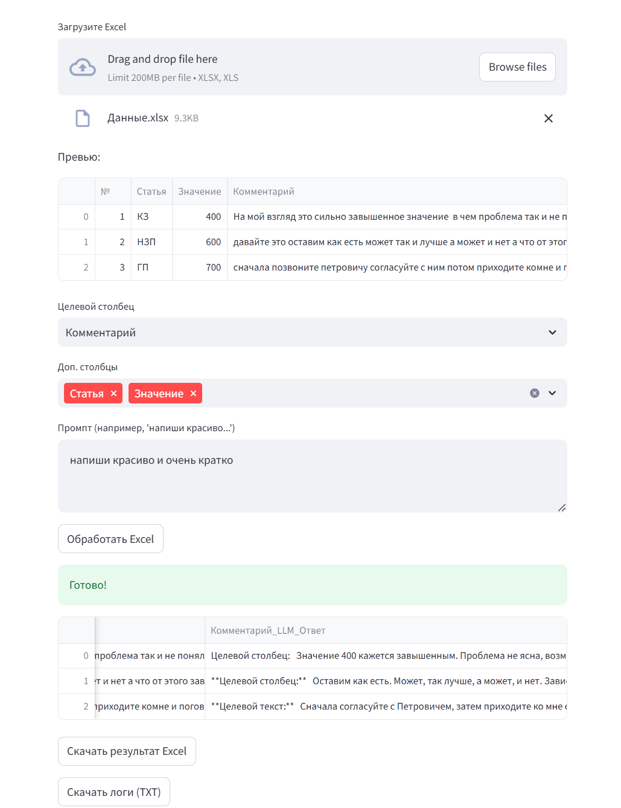

# DeepSeek Excel Processor

Это веб-приложение позволяет обрабатывать файлы Excel с использованием LLM DeepSeek. Приложение загружает Excel файл, позволяет выбрать определённый столбец для отправки его содержимого в LLM (а также дополнительные столбцы для контекста), задаёт параметры модели и после получения ответа от LLM добавляет результаты в новый столбец. Итоговый файл можно скачать для дальнейшего использования.


## Установка

### 1. Установка Python 3.10 и Anaconda/Miniconda

1. Скачайте и установите [Miniconda](https://docs.conda.io/en/latest/miniconda.html) или [Anaconda](https://www.anaconda.com/products/individual).

2. Создайте новое окружение с Python 3.10:

   ```bash
   conda create -n deepseek_env python=3.10
   conda activate deepseek_env
   ```

### 2. Установка зависимостей

Перейдите в каталог проекта (например, deepseek_excel) и выполните команду:

```bash
pip install -r requirements.txt
```

## Запуск приложения

Для старта приложения выполните команду:

```bash
streamlit run app.py
```

После этого откроется веб-интерфейс приложения в браузере.

## Пример использования

1. **Ввод API Key и настройка модели:**  
   На стартовой странице введите ваш DeepSeek API Key и настройте параметры модели:
   
   

   - Temperature (0.0 - 2.0)
   - Max Tokens (1 - 4000)
   - Top P (0.0 - 1.0)
   - Frequency Penalty (0.0 - 2.0)
   - Presence Penalty (0.0 - 2.0)

2. **Загрузка Excel файла:**  
   Используйте кнопку «Загрузите ваш Excel файл», чтобы выбрать файл с расширениями XLSX или XLS. После загрузки отобразится превью DataFrame.

3. **Выбор столбцов:**  
   Выберите столбец, данные которого будут отправлены в LLM, и по желанию дополнительные столбцы, которые добавят контекст к запросу.

4. **Ввод промпта:**  
   В поле ввода промпта укажите текст запроса для LLM. Пример:  
   "Сделай краткое содержание"  
   Этот промпт объединяется с текстом выбранного столбца и дополнительными данными из других столбцов.

5. **Обработка:**  
   После нажатия на кнопку «Обработать Excel» приложение пройдет по каждой строке выбранного столбца, отправит запрос к LLM и запишет результат в новый столбец (название которого формируется на основе исходного столбца).

6. **Скачивание результата:**  
   После завершения обработки отобразится обновленный DataFrame и появится кнопка для скачивания результирующего Excel файла.

## Дополнительные возможности

### Система логирования
- Приложение ведет детальное логирование всех запросов к API
- Для каждой строки сохраняется:
  - Номер попытки
  - Отправленные сообщения
  - Полученный ответ
  - Ошибки (если возникли)
- Доступно скачивание полных логов в формате TXT

### Механизм повторных попыток
- При ошибке запроса к API выполняется до 3-х повторных попыток
- Между попытками делается пауза 2 секунды
- Если после всех попыток не удалось получить ответ, в результат записывается сообщение об ошибке

## Структура проекта

- **app.py** – основной скрипт Streamlit приложения
- **requirements.txt** – список необходимых библиотек
- **images/** – каталог с изображениями интерфейса
- **logs.txt** – файл с логами обработки (генерируется при выполнении)

## Замечания

- Для корректной работы приложения необходимо наличие активного интернет-соединения, так как для обработки используется запрос к API DeepSeek.
- Убедитесь, что ваш API Key корректен и имеет необходимые права.
- При возникновении ошибок проверьте настройки модели и параметры запроса.

## Объяснение параметров модели

### Temperature (0.0 - 2.0)
Этот параметр управляет "творческим" выбором модели. Он определяет, насколько модель будет "решать" выбирать одно и то же или экспериментировать с разными вариантами.

**Аналогия с яблоками:**  
Представьте, что у вас есть яблоки разных сортов. Если температура низкая (например, 0.2), то вы всегда выбираете самый яркий и известный сорт (например, красное яблоко). А если температура высокая (например, 1.5), то вы можете выбрать зеленое, желтое или даже редкое яблоко, потому что модель экспериментирует с разными вариантами.

### Max Tokens (1 - 4000)
Это максимальное количество "кусочков" текста, которое модель может сгенерировать.

**Аналогия с яблоками:**  
Представьте, что у вас есть корзинка, в которую можно положить максимум N яблок. Если вы установили лимит, скажем, на 10 яблок, то даже если у вас есть много яблок, вы можете положить только 10. Это ограничивает количество текста, которое модель выдаст.

### Top P (0.0 - 1.0)
Этот параметр ограничивает выбор модели, оставляя только самые вероятные варианты.

**Аналогия с яблоками:**  
Представьте, что у вас есть большой набор яблок, но вы решаете, что будете выбирать только из тех, которые занимают, например, 80% от всей "важности" (самые вкусные яблоки). То есть, если Top P = 0.8, то вы смотрите только на самые популярные яблоки и выбираете из них, а редкие сорта не попадают в корзинку.

### Frequency Penalty (0.0 - 2.0)
Этот параметр уменьшает вероятность повторения одних и тех же слов (или элементов) слишком часто.

**Аналогия с яблоками:**  
Представьте, что вы уже положили в корзину несколько красных яблок. Если вы установите frequency penalty, то модель "накажет" повторение красных яблок, и вам будет предложено выбрать яблоко другого цвета, чтобы в корзине было разнообразие.

### Presence Penalty (0.0 - 2.0)
Этот параметр снижает вероятность повторного появления того же слова, если оно уже было использовано хотя бы один раз.

**Аналогия с яблоками:**  
Если вы уже положили в корзину хотя бы одно яблоко определенного сорта, то presence penalty говорит: "Давай попробуем выбрать яблоко другого сорта!" Даже если яблок этого сорта не так много, модель предпочтет разнообразие, чтобы не повторяться.

### Итоговое резюме параметров:
- Temperature регулирует, насколько "креативной" или предсказуемой будет модель
- Max Tokens – это лимит на количество "слов" в ответе
- Top P ограничивает выбор только самыми вероятными вариантами
- Frequency Penalty помогает избежать чрезмерного повторения
- Presence Penalty стремится к большему разнообразию в ответе

---
Данный проект предназначен для упрощения обработки Excel данных и интеграции возможностей LLM для анализа и преобразования табличных данных.


